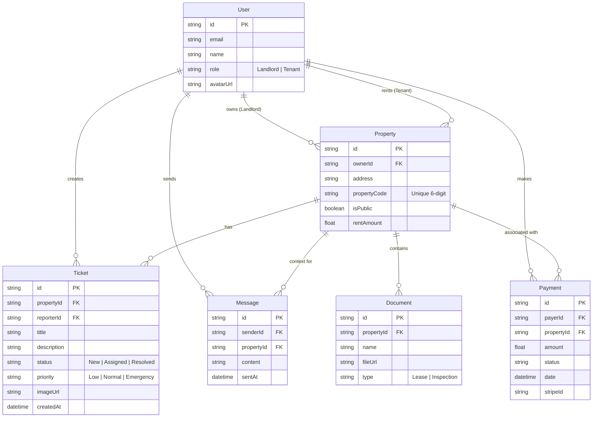

# Entity Relationship Diagram

This diagram represents the database schema for the Landy platform, showing the relationships between Users, Properties, Tickets, and other core entities.

## Entities Description

*   **User**: Represents both Tenants and Landlords. Roles are managed via the application logic/auth provider.
*   **Property**: The central entity. Belongs to a Landlord and can have multiple Tenants (e.g., roommates).
*   **Ticket**: Maintenance requests linked to a specific Property and the User who created it.
*   **Payment**: Records of rent payments or application fees.
*   **Message**: Chat messages exchanged within the context of a Property.
*   **Document**: Leases, contracts, or other files associated with a Property.

## Diagram

