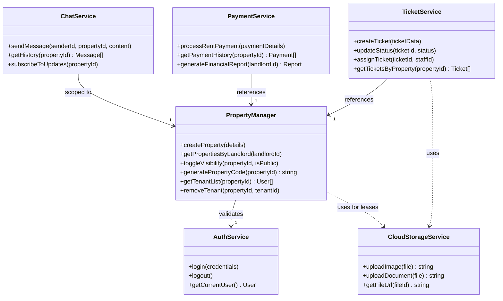

# Class Diagram

This diagram illustrates the high-level system architecture and the relationships between the main service classes and controllers in the Landy backend.

## Architecture Overview

The backend is structured around modular services that handle specific domains:
*   **Authentication**: Managed by `AuthService` (wrapping Clerk/NextAuth).
*   **Property Management**: `PropertyManager` handles listings, portfolio views, and code generation.
*   **Maintenance**: `TicketService` manages the lifecycle of maintenance requests.
*   **Communication**: `ChatService` handles real-time messaging.
*   **Financials**: `PaymentService` integrates with Stripe.

## Diagram

