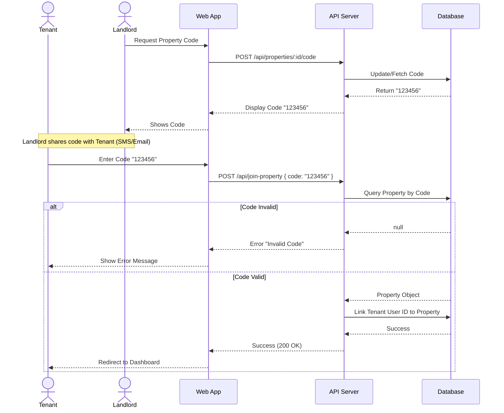

# Sequence Diagram

This diagram details the core "Tenant Onboarding" flow, illustrating how a tenant joins a property using the unique 6-digit code.

## Flow Description

1.  **Code Distribution**: The Landlord generates a code and shares it with the Tenant off-platform.
2.  **Input**: The Tenant logs in and enters the code in the "Join Your Home" portal.
3.  **Validation**: The System validates the code against the database.
4.  **Linking**: If valid, the System links the Tenant's account to the Property.
5.  **Access**: The Tenant is granted access to the Dashboard, Lease, and Chat.

## Diagram

