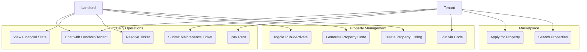

# Use Case Diagram

This diagram provides a high-level overview of the functional requirements for the two main actors: **Tenants** and **Landlords**.

## Actors & Goals

### 👤 Tenant
*   **Goal**: Find a place to live and manage their daily rental needs easily.
*   **Key Actions**: Search listings, Apply, Pay Rent, Request Repairs.

### 👤 Landlord
*   **Goal**: Efficiently manage properties and minimize vacancies.
*   **Key Actions**: List properties, Screen tenants, Collect Rent, Track Maintenance.

## Diagram

